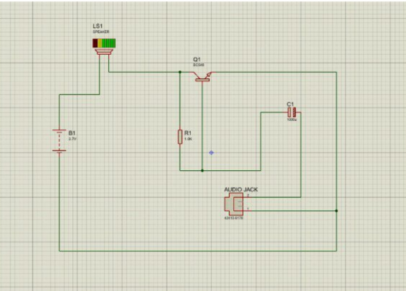
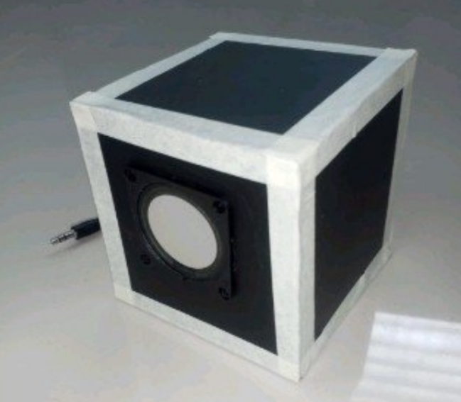

# Eza Estrosas Portfolio

Welcome to my Computer Engineering portfolio repository.

I am Eza Estrosas, a BS Computer Engineering student from CE3A. This portfolio contains selected projects, activities, and technical outputs that demonstrate my learning and experience in both software and hardware development.

---

# 📌 Personal Information

- Course: Bachelor of Science in Computer Engineering
- Section: CE3A

I am passionate about technology and problem-solving. I enjoy creating systems, designing circuits, and exploring different programming languages to improve my technical abilities.

---

# 🛠 Technical Skills

- Python Programming
- C++ Programming
- Networking Basics
- Schematic Design
- Microsoft Office
- GitHub

---

# 📂 Projects

## 🔹 Mini Amplifier Circuit Using BC548 Transistor

### Description
This project focuses on building a mini audio amplifier using the BC548 Transistor. The circuit is compact, beginner-friendly, and capable of amplifying low-power audio signals.

### Components Used
- BC548 Transistor
- Capacitor
- Resistor
- Speaker
- Battery
- Microphone Cable
- Audio Plug

### Project Screenshot
 
 
 

---

## 🔹 ALU Circuit Design

### Description
An Arithmetic Logic Unit (ALU) circuit created using logic gates and digital components to perform arithmetic and logical operations.

### Components Used
- Logic Gates
- LEDs
- Switches
- Breadboard

### Project Screenshot

---

# 📬 Contact Information

- Email: estrosaseza31@gmail.com
- GitHub: https://github.com/EzaEstrosas
